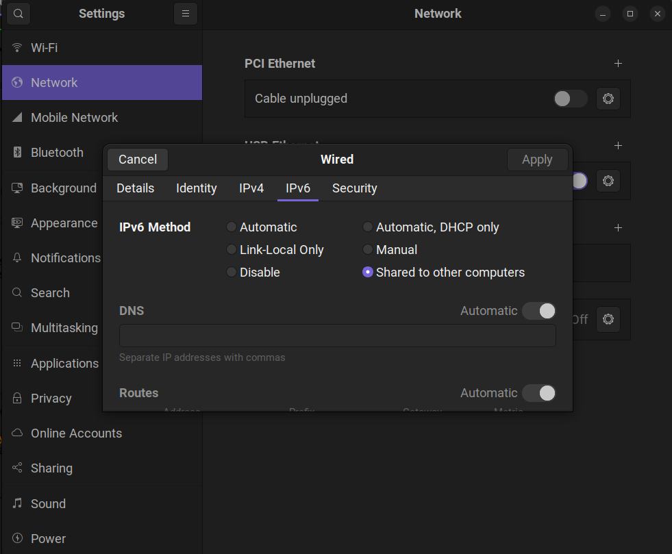

# Rockchip Toybrick exploration

Initial configuration of the Toybrick and exploration of its hardware capabilities.

## Overview

* 2x Cortex-A35
* 1 GB RAM 
* Debian 10 Buster
* ~5GB free space on the filesystem 

## Getting started

Attach Toybrick to the USB port and configure internet-sharing connection:



Login to Toybrick using ADB:

```
adb shell
```

Flush hard-assigned default IP:

```
ifconfig usb0 0.0.0.0 0.0.0.0 && dhclient
ifconfig
```

Now you can connect to Toybrick with SSH using the DNS-assigned IP:

```
ssh toybrick@10.42.0.141
```

## RKNN - neural networking API

* Header file: `/usr/include/rockchip/rknn_runtime.h`

* Dependencies of `librknn_runtime.so`:

```
/lib/aarch64-linux-gnu/libOpenVX.so.1.2
/lib/aarch64-linux-gnu/libVSC.so (0x0000007f7abdd000)
/lib/aarch64-linux-gnu/libGAL.so (0x0000007f7aa44000)
/lib/aarch64-linux-gnu/libArchModelSw.so (0x0000007f7a9fe000)
/lib/aarch64-linux-gnu/libNNArchPerf.so (0x0000007f7a9bb000)
```

## Issues

* Internet still does not work on the toybrick, perhaps due to some wrong setting
* Somehow, not all packages are present for Debian, for example `rk-tee-service` is only present in the [Fedora repo](https://repo.rock-chips.com/fedora/rk1808/aarch64/)

## Resources

1. [TB-RK1808M0 Specification](https://t.rock-chips.com/en/wiki.php?filename=Board_Guide/TB-RK1808M0)
2. [TB-RK1808M0 Programming Getting Started Guide](https://t.rock-chips.com/en/wiki.php?filename=Board_Guide/TB-RK1808S0) (actually, for TB-RK1808S0)

